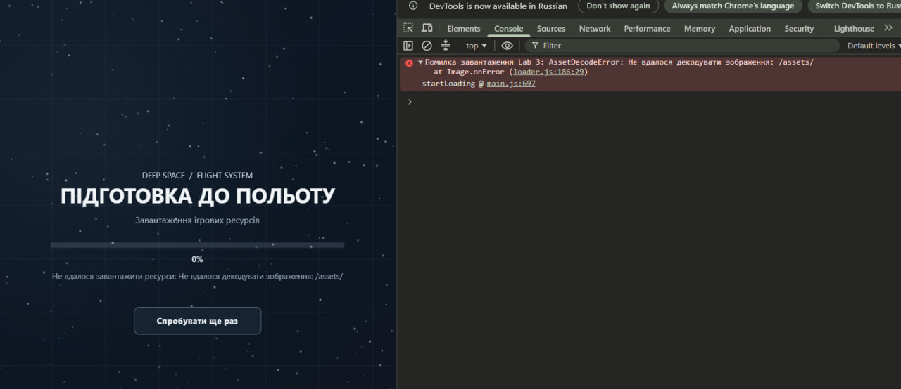
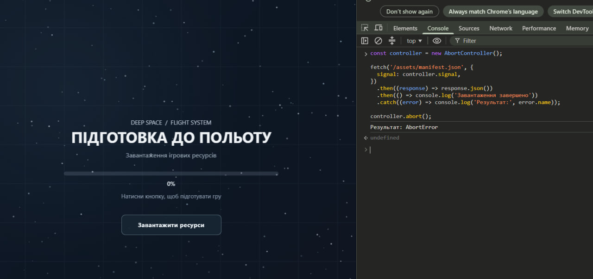
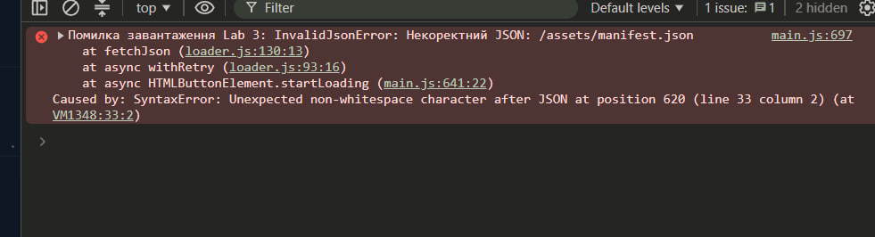

# Multiplayer Game — Lab 01

**Лабораторна робота №1 — Цикл подій та цикл ігор**

**Мета лабораторної роботи**

Дослідити принципи виконання JavaScript у браузері, роботу Event Loop, `requestAnimationFrame`, черг задач, ES-модулів, Canvas 2D API та реалізувати ігровий цикл із фіксованим кроком симуляції.

У межах лабораторної роботи створено прототип браузерної гри на JavaScript, у якій гравець керує літаком за допомогою клавіатури.

---

**Технології**

- JavaScript
- Vite
- HTML5 Canvas 2D
- ESLint
- Prettier
- `requestAnimationFrame`
- ES Modules

**Запуск проєкту**

Встановити залежності:

```bash
npm install
```

**Структура проєкту**

```text
src/
├── render/
│   ├── canvas.js
│   └── draw.js
├── sim/
│   ├── arena.js
│   └── ship.js
├── input.js
├── loop.js
├── main.js
└── style.css
```

**Опис основних файлів**

**`main.js`**

Головний файл програми. Створює Canvas, корабель, систему введення та запускає ігровий цикл. Також оновлює HUD із показниками симуляції та координатами корабля.

**`loop.js`**

Містить функцію `createLoop()`.

Ігровий цикл використовує `requestAnimationFrame` та accumulator.

Симуляція виконується з фіксованим кроком:

```js
const FIXED_DT = 1 / 60
```

Тобто фізика виконується 60 разів на секунду незалежно від частоти оновлення монітора.

**`input.js`**

Містить `createInput()`.

Стан натиснутих клавіш зберігається у замиканні за допомогою `Set`.

Фізика може перевіряти стан клавіш через:

```js
input.isDown('ArrowUp')
```

Стрілки використовуються для керування літаком.

**`sim/ship.js`**

Містить фізику корабля.

Основна функція:

```js
integrate(ship, input, dt)
```

Виконує:

- поворот;
- прискорення;
- гальмування;
- рух назад;
- обмеження максимальної швидкості;
- оновлення координат.

Функція не має залежностей від DOM.

**`sim/arena.js`**

Містить логіку арени.

Функція `wrapPosition()` реалізує загортання країв: якщо літак вилітає за одну сторону арени, він з'являється з протилежної.

**`render/canvas.js`**

Створює Canvas і враховує `devicePixelRatio`.

Це дозволяє коректно відображати Canvas на екранах із високою щільністю пікселів.

**`render/draw.js`**

Містить функцію малювання літака на Canvas.

Під час рендерингу використовується інтерполяція між попередньою та поточною позиціями корабля.

---

**Ігровий цикл**

Основна схема роботи програми:

```text
requestAnimationFrame
        ↓
      frame()
        ↓
  накопичення часу
        ↓
   fixed timestep
        ↓
     update()
        ↓
   integrate()
        ↓
     physics
        ↓
     render()
        ↓
      Canvas
```

Фіксований крок симуляції:

```text
1 / 60 ≈ 0.01667 секунди
```

При цьому частота рендерингу може бути іншою.

Наприклад:

```text
Steps/s  ≈ 60
Frames/s ≈ 144
```

Таким чином, на моніторі з частотою 144 Hz рендеринг може виконуватися 144 рази на секунду, але фізика залишається стабільною — 60 кроків на секунду.

**Інтерполяція**

Для плавного відображення положення корабля використовується коефіцієнт `alpha`.

Під час фізичного оновлення зберігається попередня позиція:

```js
ship.previousX = ship.x
ship.previousY = ship.y
```

Під час рендерингу використовується проміжна позиція:

```js
renderX = previousX + (x - previousX) * alpha
renderY = previousY + (y - previousY) * alpha
```

Це дозволяє плавніше відображати рух корабля, коли частота рендерингу вища за частоту симуляції.

**HUD**

На екрані відображаються:

- кількість виконаних кроків;
- Steps/s;
- Frames/s;
- час між кадрами;
- координати X та Y;
- кут повороту;
- поточна швидкість.

Приклад нормальної роботи:

```text
Steps/s: 60.0
Frames/s: 144.0
Frame time: ≈ 6.94 ms
```

Значення Steps/s залишається близьким до 60 навіть при іншій частоті кадрів.

**Керування**

- ↑ — рух вперед;
- ↓ — гальмування / рух назад;
- ← — поворот вліво;
- → — поворот вправо.

Для стрілок використовується `preventDefault()`, тому під час керування сторінка не прокручується.

---

**Експерименти M4**

У лабораторній роботі було виконано три експерименти, у яких ігровий цикл навмисно змінювався для дослідження його поведінки.

**Експеримент 1 — блокування головного потоку**


**Зміна**

До функції кадру було додано навмисний блокуючий цикл, який виконується кожен 60-й кадр та займає головний потік приблизно на 100 мс.


**Результат**

Під час виконання busy-wait гра періодично працює менш плавно. Виникають затримки обробки подій та ривки відображення.

На одному з вимірювань HUD показував:

- Steps/s: 60.6;
- Frames/s: 118.2;
- Frame time: 7.10 мс.


Показники HUD залежать від моменту, коли було зроблено скриншот, оскільки блокування виконується лише кожен 60-й кадр.

**Пояснення**

JavaScript у браузері виконує синхронний код у головному потоці. Поки виконується цикл `while`, Event Loop не може перейти до наступної задачі.

Тому під час блокування не можуть нормально виконуватися:

- наступні виклики `requestAnimationFrame`;
- обробка нових подій;
- оновлення інтерфейсу;
- інші задачі Event Loop.

Синхронний блок тривалістю 100 мс неможливо «обійти» в тому самому потоці JavaScript. Наступна задача може бути виконана лише після завершення блокуючого коду.

Після завершення експерименту busy-wait було видалено.

**Експеримент 2 — `setInterval` замість `requestAnimationFrame`**

**Зміна**

`requestAnimationFrame` було тимчасово замінено на `setInterval` з інтервалом 16 мс.


**Результат**

Під час експерименту було отримано різні значення частоти кадрів. В одному вимірюванні:

- Steps/s: 59.5;
- Frames/s: 62.5;
- Frame time: 0.10 мс.


Отримані значення показують, що `setInterval(frame, 16)` не гарантує стабільні 60 кадрів/с.

Реальна частота викликів залежить від роботи Event Loop, навантаження браузера та інших задач. При переході вкладки у фоновий режим браузер також може обмежувати виконання таймерів. Тому `setInterval` не є оптимальним механізмом для ігрового рендерингу.

`requestAnimationFrame` краще підходить для рендерингу, оскільки браузер синхронізує його виконання з оновленням екрана.

Після завершення експерименту `requestAnimationFrame` було відновлено.

**Експеримент 3 — змінний timestep**

**Зміна**

Фіксований крок симуляції:

```js
update(FIXED_DT)
```

було тимчасово замінено на:

```js
update(frameTime)
```

У такому варіанті симуляція виконується один раз за кадр, а `dt` залежить від фактичної тривалості кадру.


**Перевірка продуктивності**

Для експерименту використовувався CPU throttling у Chrome DevTools.


Під час першого вимірювання було використано CPU slowdown. При змінному timestep результат фізичної симуляції залежить від тривалості конкретного кадру. Якщо кадр виконується довше, значення `dt` збільшується, тому за один крок корабель переміщується на більшу відстань.

Через це при різній продуктивності пристрою траєкторія корабля може відрізнятися.

**Порівняння**

При змінному timestep:

```text
dt = час між поточним та попереднім кадром
```

Тому фізика залежить від частоти кадрів.

При фіксованому timestep:

```text
dt = 1 / 60
```

Тому фізика виконується однаковими кроками незалежно від частоти рендерингу.

Після завершення експерименту було відновлено акумулятор часу та фіксований timestep.

Це робить поведінку симуляції стабільнішою та менш залежною від продуктивності пристрою.

---

**Порівняння експериментів**

| Експеримент | Зміна | Результат |
|---|---|---|
| Blocking loop | Синхронне блокування на 100 мс | Затримки та ривки гри |
| `setInterval` | Таймер замість `requestAnimationFrame` | Частота кадрів не є стабільною |
| Variable timestep | `update(frameTime)` замість fixed timestep | Фізика залежить від тривалості кадру |
| Нормальний режим | `requestAnimationFrame` + fixed timestep | Стабільна симуляція приблизно 60 steps/s |

**Event Loop**

JavaScript використовує Event Loop для керування виконанням синхронного коду та асинхронних задач.

Спрощено роботу можна представити як:

```text
Call Stack → Task / Microtask queues → Event Loop → наступне виконання
```

Якщо головний потік зайнятий довгою синхронною операцією, Event Loop не може своєчасно обробити наступні задачі.

Саме це було продемонстровано під час першого експерименту з блокуючим циклом.

`requestAnimationFrame` дозволяє планувати виконання рендерингу відповідно до циклу оновлення браузера, тому він краще підходить для анімацій та браузерних ігор.
Висновок:
У ході лабораторної роботи було досліджено принципи роботи циклу подій JavaScript та ігрового циклу. Було реалізовано фіксований timestep із використанням requestAnimationFrame, обробку введення користувача та відображення статистики роботи гри. Також проведено експерименти з блокуванням головного потоку, setInterval та змінним timestep. Експерименти показали вплив способу організації циклу на FPS, час кадру та стабільність руху об'єктів.

**Висновок**

У ході лабораторної роботи було досліджено принципи роботи циклу подій JavaScript та ігрового циклу. Було реалізовано фіксований timestep із використанням `requestAnimationFrame`, обробку введення користувача та відображення статистики роботи гри. Також проведено експерименти з блокуванням головного потоку, `setInterval` та змінним timestep. Експерименти показали вплив способу організації циклу на FPS, час кадру та стабільність руху об'єктів.
>>>>>>> Stashed changes
# Лабораторна робота №2

**Об'єкти, прототипи та `this`: модель сутностей**

**Мета роботи**

Розширити гру з лабораторної роботи №1 за допомогою об'єктів, класів, наслідування, композиції та `Map`. Реалізувати модель ігрових сутностей, стрільбу, колізії, пошкодження, вибухи, респаун, рахунок та додаткові можливості через композицію.

---

**1. Vector2 та Entity**

Для роботи з координатами та швидкостями створено клас `Vector2`.

Реалізовані чисті методи:

- `add()` — додавання векторів;
- `sub()` — віднімання;
- `scale()` — множення на число;
- `length()` — довжина;
- `normalize()` — нормалізація;
- `rotate()` — поворот;
- `dot()` — скалярний добуток;
- `Vector2.fromAngle()` — створення вектора за кутом.

Методи `Vector2` не змінюють початковий вектор, а повертають новий об'єкт.

Базовий клас `Entity` містить такі властивості:

- `id`;
- `pos`;
- `vel`;
- `angle`;
- `radius`;
- `alive`;
- `kind`;
- `update(dt)`.

Унікальний ID створюється за допомогою приватного лічильника `#nextId` та приватного поля `#id`. Доступ до ID здійснюється через getter `id`.

---

**2. Ship та наслідування**

Корабель з лабораторної роботи №1 було перетворено на клас `Ship`, який успадковує `Entity`.

Використовується лише один рівень наслідування.

`Ship` успадковує базові властивості `Entity` та реалізує власну поведінку:

- керування;
- поворот;
- прискорення;
- гальмування;
- обмеження швидкості;
- стрільбу;
- HP.

Інші сутності також використовують `Entity` як базовий клас:

- `Ship`;
- `Bullet`;
- `Asteroid`;
- `Pickup`;
- `Explosion`.

Глибокої ієрархії класів немає.

---

**3. World та Map**

Для зберігання всіх ігрових сутностей використовується `Map`, де ключем є ID сутності.

Клас `World` реалізує:

- `spawn(entity)` — додавання сутності;
- `despawn(id)` — позначення сутності як мертвої;
- `get(id)` — пошук за ID;
- `[Symbol.iterator]` — ітерацію по сутностях;
- `ofKind(kind)` — генератор для отримання сутностей певного типу;
- `step(dt, input)` — оновлення світу.

Видалення є відкладеним: сутність спочатку отримує `alive = false`, після чого наприкінці `World.step()` виконується sweep і мертві сутності видаляються з `Map`.

---

**4. Кулі та стрільба**

Клас `Bullet` успадковує `Entity`.

Куля має:

- швидкість;
- радіус;
- шкоду;
- TTL (`time to live`).

Після завершення TTL куля стає неактивною.

Метод `Ship.fire()` створює кулю перед кораблем у напрямку його носа. При цьому до швидкості кулі додається поточна швидкість корабля.

Керування:

- `Space` — звичайний постріл;
- `H` — самонавідна куля.

---

**5. Проблема з `this`**

Проблема виникає, якщо метод класу передати як callback, наприклад `window.addEventListener('keydown', ship.fire)`.

У цьому випадку передається сама функція, а не виклик методу як `ship.fire()`. Тому `this` визначається способом виклику callback і може бути неправильним.

Основні правила `this`:

1. При використанні `new` `this` є новим створеним об'єктом.
2. При явному виклику `call()`, `apply()` або `bind()` `this` задається явно.
3. При неявному виклику `object.method()` `this` є об'єктом `object`.
4. При звичайному виклику функції в strict mode `this` дорівнює `undefined`.

Стрілочні функції не мають власного `this` і використовують `this` із зовнішнього контексту.

У проєкті проблема виправлена за допомогою wrapper-функції. Замість прямої передачі `ship.fire` використовується callback, який викликає `ship.fire(world)`.

Також можливими способами виправлення є використання `ship.fire.bind(ship)` або стрілочного поля класу.

---

**6. Астероїди та колізії**

`Asteroid` є сутністю з власними:

- координатами;
- швидкістю;
- радіусом;
- HP.

Колізії винесені в окрему систему `collision.js`.

Основна перевірка — зіткнення двох кіл. Два об'єкти вважаються такими, що зіткнулися, якщо відстань між їхніми центрами не перевищує суму їхніх радіусів.

Для пошуку пар використовується наївний алгоритм `O(n²)`, що достатньо для поточної кількості сутностей у грі.

Окремо обробляються колізії:

- куля → астероїд;
- куля → корабель;
- корабель → астероїд;
- корабель → pickup.

Кулі завдають шкоди кораблям та астероїдам.

---

**7. Приватне HP, вибухи, respawn та score**

HP корабля зберігається у приватному полі `#hp`.

Для доступу до HP використовується getter `hp`.

При отриманні шкоди значення HP зменшується. Якщо HP досягає нуля, корабель стає неактивним.

При знищенні корабля створюється `Explosion`.

`Explosion` містить частинки, які існують обмежений час і поступово зникають.

Після знищення корабля через 2 секунди створюється новий корабель у випадковій безпечній точці.

За знищення астероїда збільшується рахунок. За кожен знищений астероїд нараховується 100 очок.

Рахунок та HP відображаються на HUD.

---

**8. Композиція: Homing та Pickup**

**Чому не глибока ієрархія?**

Якби реалізовувати homing тільки через наслідування, могла б виникнути структура з окремими класами `HomingBullet` та `HomingAsteroid`.

Такий підхід створює зайві класи та прив'язує додаткову поведінку до конкретного типу об'єкта.

Наприклад, якщо пізніше знадобиться самонавідна поведінка для іншої сутності, доведеться створювати ще один клас.

Тому для додаткової поведінки використовується композиція.

**Homing**

У модулі `homing.js` створюється поведінка `createHoming(target)`.

Вона має метод `update(entity, dt)`, який змінює швидкість об'єкта в напрямку цілі.

Поведінка передається сутності як окремий об'єкт. Тому одна й та сама поведінка може бути підключена до кулі або астероїда без створення нових класів.

У грі клавіша `H` створює самонавідну кулю, яка прямує до астероїда.

**Pickup**

`Pickup` не є `Ship` і не успадковує його поведінку.

Pickup:

- залишається нерухомим;
- має радіус колізії;
- взаємодіє з кораблем;
- має окрему поведінку.

Для поточної реалізації використовується лікувальна поведінка `createHealing(25)`.

Вона передається в `Pickup` як об'єкт поведінки.

При зіткненні pickup застосовує цю поведінку до корабля та відновлює його HP.

Таким чином, механіку pickup можна змінювати без створення нових класів-нащадків.

---

**9. Експеримент з прототипами**

У JavaScript методи класів знаходяться у `prototype`.

Для створеного через `new Ship()` об'єкта ланцюжок прототипів має вигляд:

`ship → Ship.prototype → Entity.prototype → Object.prototype → null`

Наприклад, при зверненні до `ship.update` JavaScript спочатку шукає властивість у самому об'єкті `ship`, потім у `Ship.prototype`, а потім у `Entity.prototype`.

Це показує, що методи класів не копіюються в кожен об'єкт окремо, а знаходяться у відповідному прототипі.

---

**10. Результат**

У лабораторній роботі реалізовано:

- `Vector2` з чистими методами;
- базовий `Entity`;
- `Ship extends Entity`;
- `Bullet` з TTL;
- `Asteroid`;
- `Pickup`;
- `Explosion`;
- `World` на основі `Map`;
- ітерацію по `World`;
- генератор `ofKind()`;
- відкладене видалення сутностей;
- стрільбу з носа корабля;
- виправлення проблеми з `this`;
- систему circle-circle колізій `O(n²)`;
- приватне `#hp` та `get hp()`;
- пошкодження кораблів та астероїдів;
- вибухи з частинок;
- respawn через 2 секунди;
- score на HUD;
- homing через композицію;
- pickup через композицію.

---

**Reflection**

**1. Чому виникла проблема з `this`?**

`this` визначається способом виклику функції, а не місцем, де метод був оголошений.

При передачі `ship.fire` як callback метод викликається вже не як `ship.fire()`, тому `this` може бути неправильним.

Проблему можна виправити за допомогою wrapper-функції, `bind()` або стрілочного поля класу.

**2. Чому Map, а не звичайний об'єкт?**

`Map` зручний для зберігання ігрових сутностей, тому що:

- дозволяє використовувати числові ID без перетворення;
- має властивість `.size`;
- підтримує безпосередню ітерацію;
- не має проблеми з успадкованими властивостями звичайного об'єкта;
- зручний для додавання та видалення сутностей.

**3. Чому композиція краща для homing?**

Homing є поведінкою, а не окремим видом сутності.

Його можна підключити до кулі або астероїда без створення окремих класів `HomingBullet` та `HomingAsteroid`.

Це дозволяє уникнути глибокої ієрархії класів та повторення коду.

---

**Керування**

| Клавіша | Дія |
|---|---|
| `↑` | рух вперед |
| `↓` | гальмування / рух назад |
| `←` | поворот ліворуч |
| `→` | поворот праворуч |
| `Space` | звичайний постріл |
| `H` | самонавідний постріл |

---

**Висновок**

Під час лабораторної роботи гру з Lab 1 було переведено на модель сутностей із використанням класів та одного рівня наслідування. Для зберігання сутностей використано `Map`, для вибірки за типом — генератор `ofKind()`, а для додаткової поведінки — композицію. Було реалізовано стрільбу, колізії, пошкодження, вибухи, респаун, рахунок, homing та pickup. Також було розглянуто правила роботи `this` та виправлено проблему з передаванням методу класу як callback.
---

# Лабораторна робота №3

**Асинхронний JavaScript: Promises, async/await і екран завантаження**

**Мета роботи**

Продовжити розробку браузерної гри з лабораторних робіт №1–2 та дослідити асинхронне виконання JavaScript. Реалізувати завантаження ресурсів без блокування головного потоку, відображення прогресу завантаження, роботу зі спрайтами та звуком, систему подій і лобі з вибором ігрової кімнати.

**Технології**

- JavaScript;
- Promises;
- `async/await`;
- `Promise.all()`;
- `fetch`;
- `AbortController`;
- `AbortSignal.timeout()`;
- `EventTarget` і `CustomEvent`;
- Canvas 2D API;
- Web Audio API;
- Vite;
- HTML5;
- Git та GitHub.

---

**1. Конвеєр завантаження ресурсів**

Для завантаження ресурсів створено модуль `src/assets/loader.js`.

Він забезпечує завантаження зображень, звуків і JSON-файлів за допомогою функцій:

- `loadImage()` — завантаження та декодування зображень;
- `loadAudio()` — завантаження та декодування аудіофайлів;
- `loadJson()` — завантаження JSON;
- `fetchJson()` — спільна функція отримання JSON із перевіркою `response.ok`;
- `withRetry()` — повторні спроби завантаження;
- `loadAll()` — завантаження всіх ресурсів.

Список ресурсів і параметри арени зберігаються в `public/assets/manifest.json`.

Для обробки помилок використовується клас `HttpError`, який містить HTTP-статус і адресу ресурсу, а також `InvalidJsonError` для некоректного JSON.

**Повторні спроби**

Функція `withRetry()` підтримує повторні спроби з експоненційним збільшенням затримки та випадковим відхиленням — jitter.

Затримка збільшується після кожної невдалої спроби. HTTP-помилки 4xx, помилки некоректного JSON та скасування операції не запускають повторні спроби.

Для скасування завантаження використовується `AbortSignal`.

**Паралельне завантаження**

Функція `loadAll()` використовує `Promise.all()`, щоб завантажувати ресурси паралельно. Під час завантаження оновлюється кількість успішно завантажених ресурсів і загальний прогрес.

Для кожного ресурсу передбачено повідомлення про успішне завантаження або помилку.

Гра починає роботу лише після завершення `await loadAll(...)`.

---

**2. Екран завантаження**

Для відображення процесу завантаження створено екран із прогресом.

Він показує перебіг завантаження ресурсів до запуску гри. Після завершення завантаження користувач переходить до лобі.

Такий підхід дозволяє бачити стан завантаження та обробляти помилки до початку ігрового процесу.

---

**3. Порівняння паралельного та послідовного завантаження**

Для перевірки продуктивності проведено вимірювання часу завантаження шести ресурсів.

Паралельний варіант використовує `Promise.all()`, а послідовний — цикл із `await`, у якому кожен наступний ресурс завантажується після попереднього.

Вимірювання виконувалися за допомогою `performance.now()`.

**Результати вимірювань**

| Запуск | Паралельне завантаження, мс | Послідовне завантаження, мс |
|---|---:|---:|
| 1 | 14,80 | 15,40 |
| 2 | 16,50 | 15,50 |
| 3 | 14,20 | 16,10 |
| 4 | 18,80 | 22,00 |
| **Середнє значення** | **16,08** | **17,25** |

Середній час паралельного завантаження становив приблизно 16,08 мс, а послідовного — 17,25 мс.

У цих вимірюваннях паралельний варіант був швидшим приблизно на 1,18 мс, або 6,8%.

Результати окремих запусків відрізнялися. Це може бути пов'язано з кешуванням, мережевими умовами та навантаженням браузера. У другому запуску послідовне завантаження виявилося трохи швидшим.

Отже, результати демонструють перевагу паралельного завантаження в середньому для проведених вимірювань, але різниця на таких малих проміжках часу залежить від умов тестування.

---

**4. Спрайти та відображення ігрових об'єктів**

Для графічного оформлення гри використовуються аркуші спрайтів:

- `ship-sheet.svg` — корабель;
- `bullet-sheet.svg` — кулі;
- `asteroid-sheet.svg` — астероїди.

Для відображення кадрів реалізовано функцію `drawSpriteFrame()`, яка використовує `drawImage()` з вихідними прямокутниками.

Завдяки цьому потрібний кадр вибирається з аркуша спрайтів і відображається на Canvas.

Корабель, кулі та астероїди успішно відображаються в грі.

---

**5. Звукова система та події**

Для роботи зі звуком створено окремий модуль `src/audio.js`, який використовує Web Audio API.

Він працює з `AudioContext` та декодованими аудіобуферами. Звуки пострілу, влучання та вибуху завантажуються з ресурсів гри.

Для розділення симуляції та аудіосистеми створено `src/sim/events.js`.

Використовуються події:

- `fired` — постріл;
- `hit` — влучання;
- `exploded` — вибух.

Для передавання подій застосовуються `EventTarget` і `CustomEvent`.

Симуляція повідомляє про події, а аудіомодуль підписується на них і відтворює відповідні звуки. Це дозволяє не пов'язувати безпосередньо логіку симуляції з аудіосистемою.

Роботу звуків і відображення рахунку перевірено під час запуску гри.

---

**6. Лобі через HTTP**

Перед початком гри реалізовано лобі, у якому користувач може ввести ім'я, вибрати кімнату та натиснути кнопку приєднання.

Список кімнат завантажується через `/api/rooms`. Для поточної реалізації використовується статичний JSON-файл, який обслуговує Vite.

Для роботи лобі створено два модулі:

- `src/lobby.js` — логіка лобі;
- `src/lobby-ui.js` — відображення інтерфейсу.

Клас `Lobby` успадковує `EventTarget` і забезпечує отримання та оновлення списку кімнат, вибір кімнати та обробку помилок.

**Оновлення та скасування запитів**

Поки лобі відкрите, список кімнат періодично оновлюється. Для запитів використовуються тайм-аути через `AbortSignal.timeout()`.

Під час виходу з лобі запити скасовуються через `AbortController`, а періодичне оновлення зупиняється.

Це дозволяє уникнути непотрібних запитів після виходу користувача.

**Вибір арени**

Для гри реалізовано три кімнати:

- Training Room;
- Deep Space;
- Asteroid Field.

Після натискання кнопки приєднання запускається локальна гра з конфігурацією вибраної кімнати.

Сьогодні було виправлено відображення арени: вона центрується, масштабується відповідно до доступного простору та має рамку. Розміри арени залежать від вибраної кімнати.

Роботу всіх трьох кімнат перевірено.

---

**7. Обробка помилок завантаження**

Для перевірки обробки помилок було виконано чотири сценарії:

1. Помилка завантаження спрайта (404).
2. Тайм-аут мережевого запиту.
3. Переривання завантаження.
4. Некоректний JSON.

Для кожного сценарію було зроблено скриншоти.

Ці перевірки демонструють поведінку програми під час помилок завантаження та роботу механізмів обробки помилок.

**Галерея помилок**

*Помилка 404 під час завантаження спрайта*



*Тайм-аут мережевого запиту*


*Переривання завантаження*



*Некоректний JSON*



---

**8. Головоломки з порядком виконання JavaScript**

У цьому розділі розглядається порядок виконання синхронного коду, мікрозадач і задач, запланованих за допомогою `setTimeout` та `requestAnimationFrame`.

**Головоломка 1 — Promise і setTimeout**

Код:

```js
console.log('A');

setTimeout(() => console.log('B'), 0);

Promise.resolve().then(() => console.log('C'));

console.log('D');
```

Результат:

```text
A
D
C
B
```

Пояснення: спочатку виконуються синхронні команди `A` і `D`, потім мікрозадача `Promise.then()` виводить `C`, а після неї виконується callback `setTimeout()`, який виводить `B`.

**Головоломка 2 — використання await**

Код:

```js
async function run() {
  console.log('A');

  await Promise.resolve();

  console.log('B');
}

run();

console.log('C');
```

Результат:

```text
A
C
B
```

Пояснення: після `await` продовження асинхронної функції виконується пізніше, тому синхронний виклик `console.log('C')` відбувається раніше за `console.log('B')`.

**Головоломка 3 — setTimeout усередині then**

Код:

```js
console.log('A');

Promise.resolve().then(() => {
  console.log('B');

  setTimeout(() => console.log('C'), 0);

  console.log('D');
});

setTimeout(() => console.log('E'), 0);

console.log('F');
```

Результат:

```text
A
F
B
D
E
C
```

Пояснення: спочатку виконується синхронний код. Потім мікрозадача виводить `B` і `D`. Таймер `E` було заплановано раніше за таймер `C`, тому він виконується першим.

**Головоломка 4 — requestAnimationFrame**

Код:

```js
console.log('A');

requestAnimationFrame(() => {
  console.log('B');
});

Promise.resolve().then(() => console.log('C'));

console.log('D');
```

Результат:

```text
A
D
C
B
```

Пояснення: синхронні команди виконуються першими, потім мікрозадача `Promise`. Callback `requestAnimationFrame` виконується під час наступного циклу відображення браузера, тому `B` з'являється пізніше.

**Головоломка 5 — async/await, Promise і таймер**

Код:

```js
async function first() {
  console.log('A');

  await second();

  console.log('B');
}

async function second() {
  console.log('C');

  return Promise.resolve();
}

first();

setTimeout(() => console.log('D'), 0);

Promise.resolve().then(() => console.log('E'));

console.log('F');
```

Результат:

```text
A
C
F
E
B
D
```

Пояснення: функції починають виконуватися синхронно, тому спочатку з'являються `A` і `C`. Після `await` продовження `first()` відкладається. Синхронний код виводить `F`, а мікрозадачі виводять `E` і `B` до виконання таймера `D`.

---

**9. Результати лабораторної роботи**

У ході лабораторної роботи реалізовано:

- завантаження зображень, звуків і JSON;
- обробку HTTP-помилок та некоректного JSON;
- повторні спроби з експоненційною затримкою та jitter;
- скасування завантаження через `AbortSignal`;
- паралельне завантаження ресурсів через `Promise.all()`;
- відображення прогресу завантаження;
- відображення корабля, куль та астероїдів зі спрайтів;
- звукову систему на основі Web Audio API;
- систему подій через `EventTarget` і `CustomEvent`;
- лобі з отриманням кімнат через HTTP;
- періодичне оновлення списку кімнат, тайм-аути та скасування запитів;
- запуск гри з конфігурацією вибраної арени;
- порівняння паралельного та послідовного завантаження;
- п'ять головоломок із порядком виконання JavaScript;
- чотири сценарії перевірки помилок завантаження.

---

**Висновок**

У ході лабораторної роботи було досліджено асинхронне виконання JavaScript та реалізовано конвеєр завантаження ресурсів із використанням Promises, `async/await`, `Promise.all()` і механізмів скасування запитів. Було створено екран завантаження, реалізовано відображення спрайтів, звукову систему на основі Web Audio API та обмін подіями між модулями. Також було розроблено лобі з отриманням списку кімнат через HTTP, вибором імені гравця та конфігурації арени. Проведено порівняння паралельного й послідовного завантаження та підготовлено головоломки для дослідження порядку виконання асинхронного коду.

