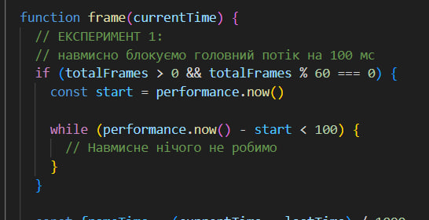
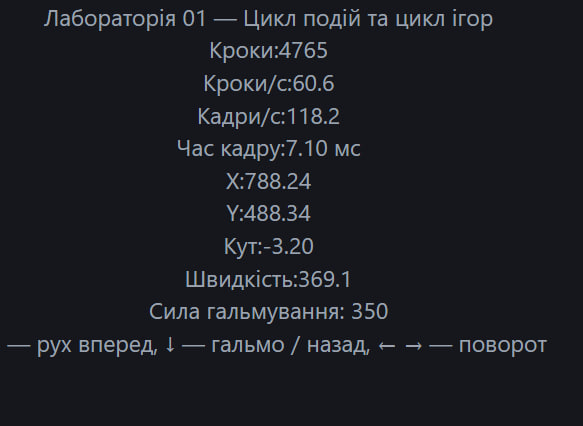
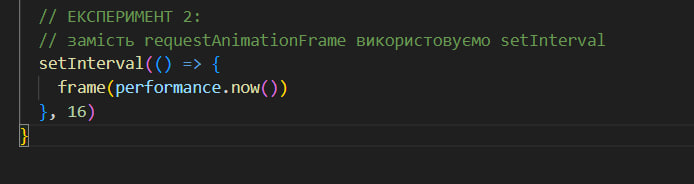
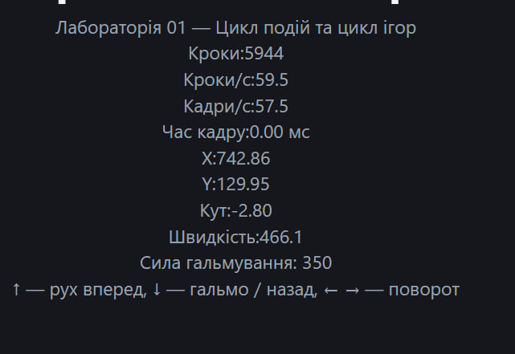
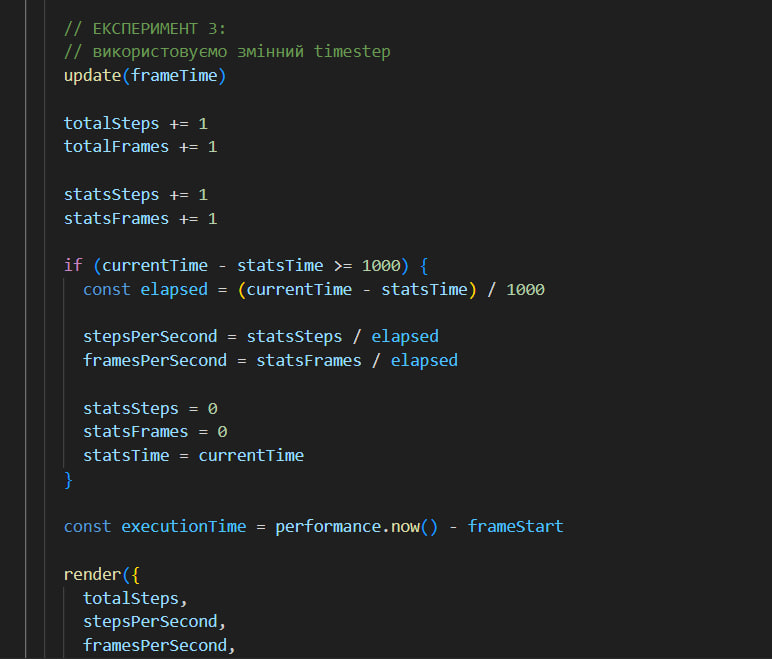
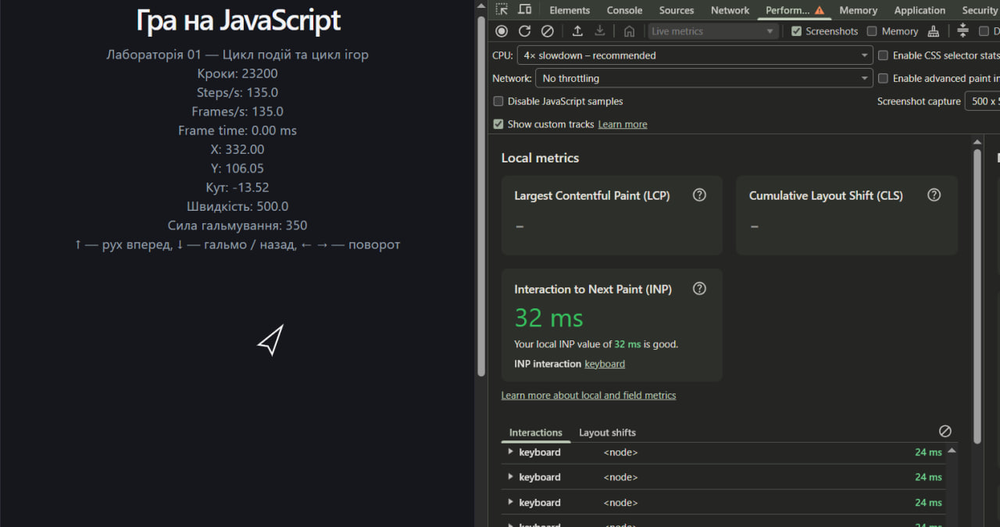

Multiplayer Game — Lab 01
Лабораторна робота №1 — Цикл подій та цикл ігор

Мета лабораторної роботи — дослідити принципи виконання JavaScript у браузері, роботу Event Loop, `requestAnimationFrame`, черг задач, ES-модулів, Canvas 2D API та реалізувати ігровий цикл із фіксованим кроком симуляції.

У межах лабораторної роботи створено прототип браузерної гри на JavaScript, у якій гравець керує літаком за допомогою клавіатури.

---
Технології

- JavaScript
- Vite
- HTML5 Canvas 2D
- ESLint
- Prettier
- `requestAnimationFrame`
- ES Modules

Запуск проєкту

Встановити залежності:

```bash
npm install

           Структура проєкту
src/
├── render/
│   ├── canvas.js
│   └── draw.js
├── sim/
│   ├── arena.js
│   └── ship.js
├── input.js
├── loop.js
├── main.js
└── style.css

main.js
Головний файл програми.
Створює Canvas, корабель, систему введення та запускає ігровий цикл. Також оновлює HUD із показниками симуляції та координатами корабля.

loop.js
Містить функцію createLoop().
Ігровий цикл використовує requestAnimationFrame та accumulator.
Симуляція виконується з фіксованим кроком:
const FIXED_DT = 1 / 60

Тобто фізика виконується 60 разів на секунду незалежно від частоти оновлення монітора.

input.js
Містить createInput().
Стан натиснутих клавіш зберігається у замиканні за допомогою Set.
Фізика може перевіряти стан клавіш через:
input.isDown('ArrowUp')

Стрілки використовуються для керування літаком.

sim/ship.js
Містить фізику корабля.
Основна функція:
integrate(ship, input, dt)
виконує:
- поворот;
- прискорення;
- гальмування;
- рух назад;
- обмеження максимальної швидкості;
- оновлення координат.
Функція не має залежностей від DOM.

sim/arena.js
Містить логіку арени.
Функція wrapPosition() реалізує загортання країв: якщо літак вилітає за одну сторону арени, він з`являється з протилежної.

render/canvas.js
Створює Canvas і враховує devicePixelRatio.
Це дозволяє коректно відображати Canvas на екранах із високою щільністю пікселів.

render/draw.js
Містить функцію малювання літака на Canvas.
Під час рендеру використовується інтерполяція між попередньою та поточною позиціями корабля.
Ігровий цикл

Основна схема роботи програми:
requestAnimationFrame
        ↓
    frame()
        ↓
  накопичення часу
        ↓
 fixed timestep
        ↓
    update()
        ↓
  integrate()
        ↓
    physics
        ↓
    render()
        ↓
      Canvas


Фіксований крок симуляції:
1 / 60 ≈ 0.01667 секунди

При цьому частота рендерингу може бути іншою.
Наприклад:
Steps/s  ≈ 60
Frames/s ≈ 144

Таким чином, на моніторі з частотою 144 Hz рендер може виконуватися 144 рази на секунду, але фізика залишається стабільною — 60 кроків на секунду.
Інтерполяція
Для плавного відображення положення корабля використовується коефіцієнт alpha.
Під час фізичного оновлення зберігається попередня позиція:
ship.previousX = ship.x
ship.previousY = ship.y

Під час рендеру використовується проміжна позиція:
renderX =
    previousX + (x - previousX) * alpha

renderY =
    previousY + (y - previousY) * alpha

Це дозволяє плавніше відображати рух корабля, коли частота рендерингу вища за частоту симуляції.

HUD
На екрані відображаються:
- кількість виконаних кроків;
- Steps/s;
- Frames/s;
- час між кадрами;
- координати X та Y;
- кут повороту;
- поточна швидкість.
Приклад нормальної роботи:
Steps/s: 60.0
Frames/s: 144.0
Frame time: ≈ 6.94 ms

Значення Steps/s залишається близьким до 60 навіть при іншій частоті кадрів.
Керування
↑ — рух вперед
↓ — гальмування / рух назад
← — поворот вліво
→ — поворот вправо

Для стрілок використовується preventDefault(), тому під час керування сторінка не прокручується.
        

Експерименти M4

У лабораторній роботі було виконано три експерименти, у яких ігровий цикл навмисно змінювався для дослідження його поведінки.

Експеримент 1 — блокування головного потоку

Зміна

До функції кадру було додано навмисний блокуючий цикл, який виконується кожен 60-й кадр та займає головний потік приблизно на 100 мс.




 Результат

Під час виконання busy-wait гра періодично працює менш плавно. Виникають затримки обробки подій та ривки відображення.

На одному з вимірювань HUD показував:

- Steps/s: 60.6;
- Frames/s: 118.2;
- Frame time: 7.10 мс.



Показники HUD залежать від моменту, коли було зроблено скріншот, оскільки блокування виконується лише кожен 60-й кадр.

Пояснення

JavaScript у браузері виконує синхронний код у головному потоці. Поки виконується цикл `while`, Event Loop не може перейти до наступної задачі.
Тому під час блокування не можуть нормально виконуватися:

- наступні виклики `requestAnimationFrame`;
- обробка нових подій;
- оновлення інтерфейсу;
- інші задачі Event Loop.

Синхронний блок тривалістю 100 мс неможливо «обійти» в тому самому потоці JavaScript. Наступна задача може бути виконана лише після завершення блокуючого коду.

Після завершення експерименту busy-wait було видалено.

Експеримент 2 — `setInterval` замість `requestAnimationFrame`

Зміна

`requestAnimationFrame` було тимчасово замінено на `setInterval` з інтервалом 16 мс.



Результат

Під час експерименту було отримано різні значення частоти кадрів.В одному вимірюванні:

- Steps/s: 59.5;
- Frames/s: 62.5;
- Frame time: 0.10 мс.



Отримані значення показують, що `setInterval(frame, 16)` не гарантує стабільні 60 кадрів/с.

Реальна частота викликів залежить від роботи Event Loop, навантаження браузера та інших задач. При переході вкладки у фоновий режим браузер також може обмежувати виконання таймерів. Тому `setInterval` не є оптимальним механізмом для ігрового рендерингу.

`requestAnimationFrame` краще підходить для рендерингу, оскільки браузер синхронізує його виконання з оновленням екрану.

Після завершення експерименту `requestAnimationFrame` було відновлено.

---
 Експеримент 3 — змінний timestep

Зміна

Фіксований крок симуляції:

`update(FIXED_DT)`

було тимчасово замінено на:

`update(frameTime)`

У такому варіанті симуляція виконується один раз за кадр, а `dt` залежить від фактичної тривалості кадру.



Перевірка продуктивності

Для експерименту використовувався CPU throttling у Chrome DevTools.



Під час першого вимірювання було використано CPU slowdown. При змінному timestep результат фізичної симуляції залежить від тривалості конкретного кадру. Якщо кадр виконується довше, значення `dt` збільшується, тому за один крок корабель переміщується на більшу відстань. 
Через це при різній продуктивності пристрою траєкторія корабля може відрізнятися.

Порівняння

При змінному timestep:

`dt = час між поточним та попереднім кадром`

тому фізика залежить від частоти кадрів.

При фіксованому timestep:

`dt = 1 / 60`

тому фізика виконується однаковими кроками незалежно від частоти рендерингу.

Після завершення експерименту було відновлено акумулятор часу та фіксований timestep.

Це робить поведінку симуляції стабільнішою та менш залежною від продуктивності пристрою.

---
Порівняння експериментів

| Експеримент | Зміна | Результат |
|---|---|---|
| Blocking loop | Синхронне блокування на 100 мс | Затримки та ривки гри |
| `setInterval` | Таймер замість `requestAnimationFrame` | Частота кадрів не є стабільною |
| Variable timestep | `update(frameTime)` замість fixed timestep | Фізика залежить від тривалості кадру |
| Нормальний режим | `requestAnimationFrame` + fixed timestep | Стабільна симуляція приблизно 60 steps/s |

Event Loop

JavaScript використовує Event Loop для керування виконанням синхронного коду та асинхронних задач.

Спрощено роботу можна представити як:

`Call Stack → Task / Microtask queues → Event Loop → наступне виконання`

Якщо головний потік зайнятий довгою синхронною операцією, Event Loop не може своєчасно обробити наступні задачі.

Саме це було продемонстровано під час першого експерименту з блокуючим циклом.

`requestAnimationFrame` дозволяє планувати виконання рендерингу відповідно до циклу оновлення браузера, тому він краще підходить для анімацій та браузерних ігор.
Висновок:
У ході лабораторної роботи було досліджено принципи роботи циклу подій JavaScript та ігрового циклу. Було реалізовано фіксований timestep із використанням requestAnimationFrame, обробку введення користувача та відображення статистики роботи гри. Також проведено експерименти з блокуванням головного потоку, setInterval та змінним timestep. Експерименти показали вплив способу організації циклу на FPS, час кадру та стабільність руху об'єктів.
